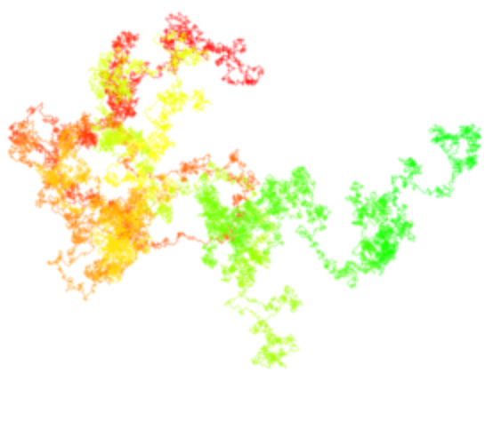

# Random Walks
Playing with Random Walks visualizations in Canvas

## Demo
Just open [demo.html](demo.html) to see it in action.

## Usage

After requiring or including `random-walks.js`, just instantiate inside a containing `div` like so:

    	

    	
    	

The first argument is that container ID, the second is the number of iterations.

The object returned has two methods: `update` and `animate`. Update takes a number of steps and updates the visual, nixing the earliest number of steps and adding the same number to the front. `animate`, which calls `update`, takes a number of steps and an interval for how often to run `update` (in milliseconds).